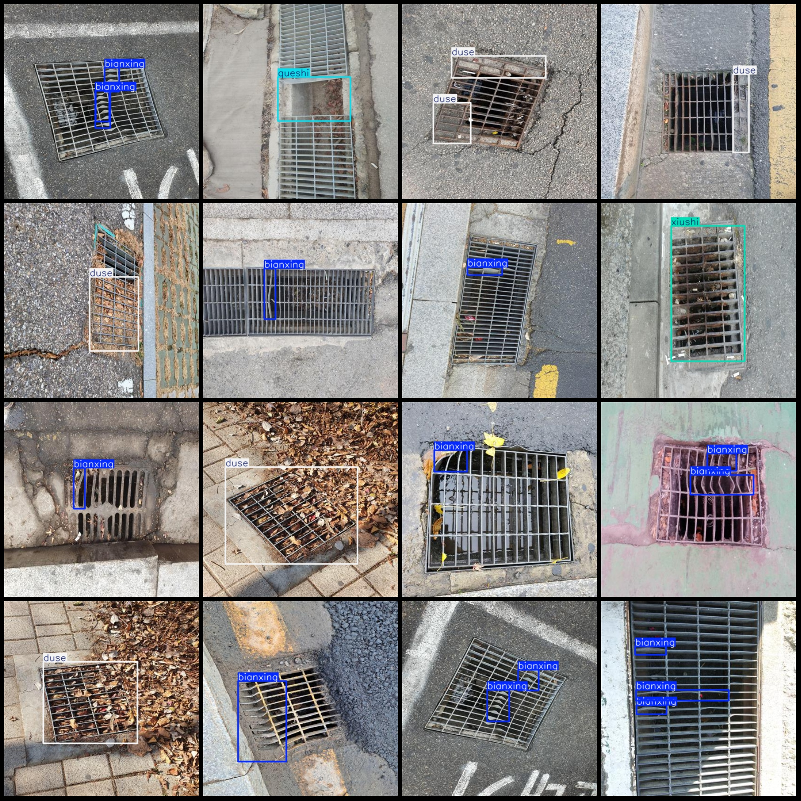
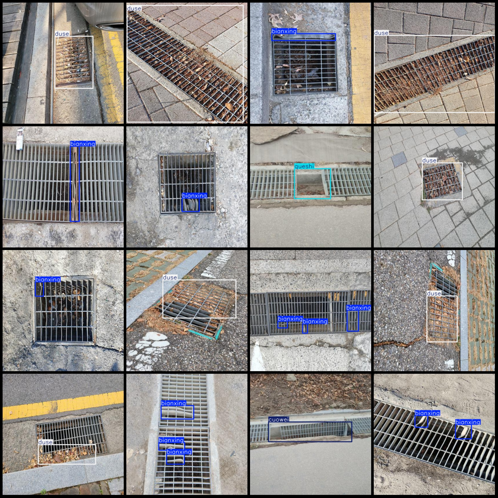

# Smart City Rainwater Catchment Drainage Facility Damage, Corrosion, and Obstruction Detection Dataset in VOC+YOLO Format: 1432 Images with 6 Categories

Dataset Format: Pascal VOC format + YOLO format (txt files without the split path, only containing jpg images along with their corresponding VOC format xml files and YOLO format txt files)
Number of Images: 1432
Number of Annotations: 1432
Number of Annotations (txt files): 1432
Number of Annotation Categories: 6
Annotation Category Names (note that the order in the YOLO format is different from this, aligning with the labels folder's classes.txt): ["bianxing", "cuowei", "duse", "queshi", "sunhuai", "xiushi"]
Number of Boxes per Category:
- Bianxing (Deformation) = 1623
- Cuowei (Misalignment) = 18
- Dushu (Obstruction) = 345
- Queshi (Missing) = 28
- Sunhuai (Damage) = 32
- Xiushi (Rust) = 166
Total Boxes: 2212
Image Resolution: 416x416
Annotation Tool Used: labelImg
Annotation Rules: Draw a rectangle around each category
Important Note: The dataset does not have separate training, validation, or test sets; you should create your own.
Special Remark: This dataset does not guarantee any accuracy in training models or weight files.
Image Preview:
Annotation Example:

## Images

Here is a pay link on Stripe ( https://buy.stripe.com/3cs8yP7sY87d0vu9AB ). Please contact me lonlonago@foxmail.com after funding $89, and I will send you a complete data files , thank you!

